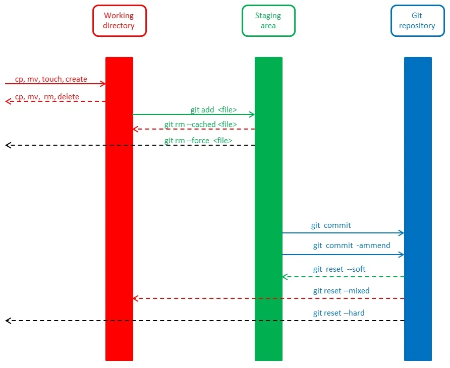

# Staging Area
It's when our changes were tracked but not committed. Then run `git add .` or `git add <file>`, you put the changes in staging area.

## What is Staging Area
It's an index, the process before to commited the changes.